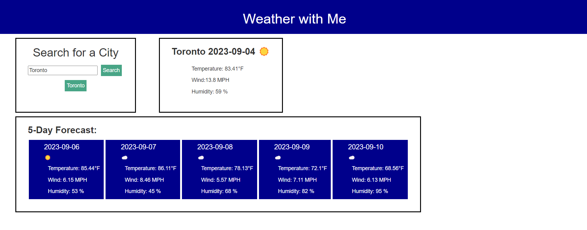

# Weather-with-me

## Description
I have created a Weather finder for any city the user wants to know. It will display today's weather, or current weather of the city searched and the future weather for 5 days in advance. It displays the name of the city, the date, the temperature, the wind and the humidity of the day. It also saves the future search.

[Go to Website here](https://ari07-ari.github.io/Weather-with-me/)

## Installation
The first step was the creation of the repo. Then create the folders for each section and their files, html, javascript and css. 

## Usage
The way to use this web application is by entering (writing) the city that the user wants to search. Then 2 blocks will appear showing the weather conditions for the current day and the next 5 days. It helps people find the weather in everywhere the world. If the user wonders how the weather is in another city, just search it up, easy as that.

## Credits
The University of Toronto,
Ariana Vinamagua